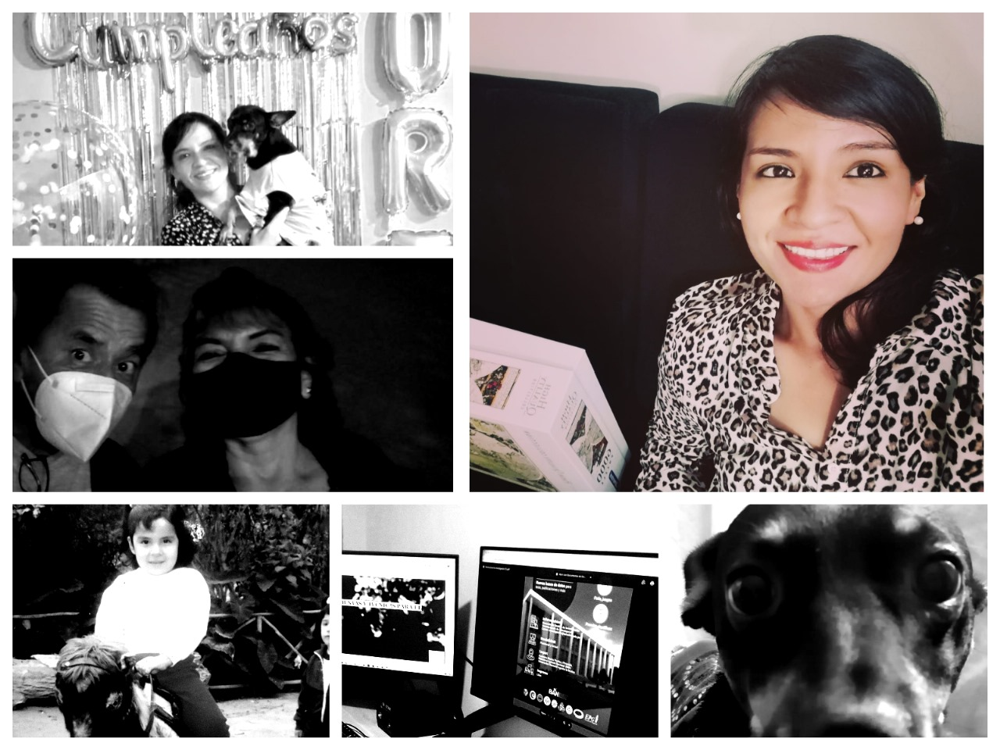

---
hide:
  - navigation
  - toc
---
#
## **Acerca de mí** 
{ align=left }
**Áreas de especialización**:   📊 Estadística  📰Ciencia de datos 🌏Análisis de datos espaciales 

**Intereses y actividades** 

👩‍💻🎓💝 Desarrollo de contenidos  creativos   | 🚴🚶Spinning y largas caminatas con música

✨ Me encantan las estadísticas.   
✨ Series de tiempo y aprendizaje profundo.   
✨ Ingeniería de Aprendizaje automático.    
✨ Computación en la nube .   
✨ Procesamiento del lenguaje natural e investigación reproducible.   
✨ Modelamiento espacial de especies,  incendios forestales y deforestación.     

## **Información de contacto**  

 

 

 - **Sitios Web**: [Portafolio](https://corinads.github.io/data-portfolio/)

